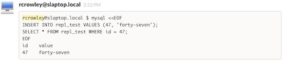
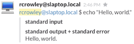

`slack`
=======

Run a command; post it and its standard input, output, and error to Slack.  It's a tool for people that collaborate on UNIX servers.

Installation
------------

First, install `slack.sh` as `/usr/local/bin/slack`:

    sudo make install

Next, visit <https://my.slack.com/services/new> and create a new **Incoming Webhook**.  Copy **Your Unique Webhook URL** and put it in your shell's environment:

    export SLACK_WEBHOOK_URL="https://TEAM.slack.com/services/hooks/incoming-webhook?token=TOKEN"

Put this in your shell's `~/.profile` or similar and make sure you source that file with `. ~/.profile` before you run `slack`.

Usage
-----

`slack` will post the command-line plus standard output and standard error to Slack:

    slack echo "Hello, world."

It will also capture standard input if you tell it to:

    slack --stdin mysql <"backfill.sql"

If you like, the output can be made into a nice pretty Slack attachment:

    slack --attach echo "Hello, world."

And of course, you can point it at any channel, not just the one you configure as the default:

    slack --channel="#general" echo "Hello, world."
